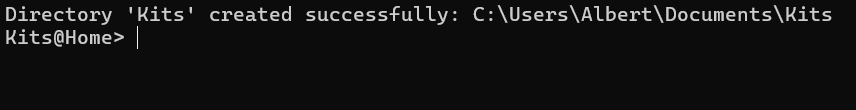

# Monkey Model Kits

**The model-kit builder's control panel !**

## What ?
Have you ever wondered how much time you spent on your collection ? 
Or how much money you spent buying model kits (We would prefer not knowing too...) 
Well, I CAN answer those questions you've never wanted an answer to !

This software allows you to log all your models, be it work in progress ones, those already sitting on a shelf, or desperately waiting for the day you'll get them out of the box...

## But how does MMK work ??

Mind you, I _can_ answer this question ! _~~(can I ?)~~_

When launching the executable you will be presented with a terminal showing this:

It informs you it has successfully created a directory where it will store all your collection files once you get started.

Now you can input your command to tell MMK what to do. 
You have several options at this point:
* Creating a file
* Opening a file
* Displaying the help message

MMK for now can only open .mkit files since I haven't yet decided of a standard to handle .csv's. 
When opening or creating a file, on windows the file name won't be case sensitive: meaning "test" and "TEsT" are the same files; but watch out: on linux files are case sensitive.
### Creating a file
You simply have to write "create [file name]", MMK will then create a file in the default folder.

### Opening a file
As simply as creating a file, write "open [file name]" and MMK will open the file and extract all the available data from it.

### Help message
When writing "help", the help message will be displayed, explaining in more details all you can do.

## Models
In MMK a model is a bunch of variables, them being: a name, a grade, a price, a status and a list of sessions.
Let's get into those a bit.

- A name is pretty explanatory, a string of characters that represent the name, sure. 
- But what is a grade ?
The grade is the representation of the different formats bandai has released yet, they are listed as such: 
  - EG, SD, HG, RG, MG, PG, MS, OG, ST
- The price is a bunch of numbers with a decimal representing how much you paid for it.
- The status describes how far you are into the kit, I have 3 for now:
  - BCK : for **B**a**ck**logged, a kit owned but not started yet.
  - WIP : for **W**ork **I**n **P**rogress, a started kit not finished yet.
  - BLT : for **B**ui**lt**, a kit collecting dust in your beautiful 𝓋𝒾𝓉𝓇𝒾𝓃𝑒☕ (french for display cabinet).
- And a list of sessions: those are the different times you have spent working on your kit.

## Files
I want MMK to be the most easily usable possible, and for this I want to also have the files humanly understandable, so if you want to manually write one, you can.

Here's what a mkit file should look like:
1. Wrap your collection in parentheses ().
2. On the second line, write the amount of models present in your collection currently.
3. Write the time zone you are located in, in UTC format.
4. You can now input your models:
   1. Wrap your model with brackets [].
   2. Write the values following like that: "name: "Name"".
   3. "grade: \<Grade>"
   4. "price: Price"
   5. "status: \<status>"
   6. "sessions: {}"
      1. Sessions, being a list, have to be listed. Each session is separated by a "|".
      2. Sessions can be logged by date or duration.
      3. A date is stored as such : 2024.01.24-20.14.29 > 2024.01.25-02.41.34 (YYYY.MM.DD-hh.mm.ss), the ">" indicates the separation between start and stop date.
      4. A duration is stored as such : **\_** hh:mm:ss, the "_" indicates to the program that what you wrote is a duration and shall be treated as such.

Here is now an example of a correct collection file:

